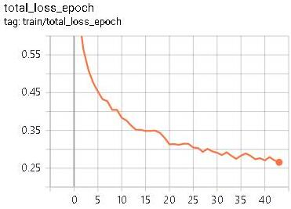
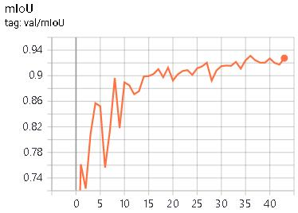
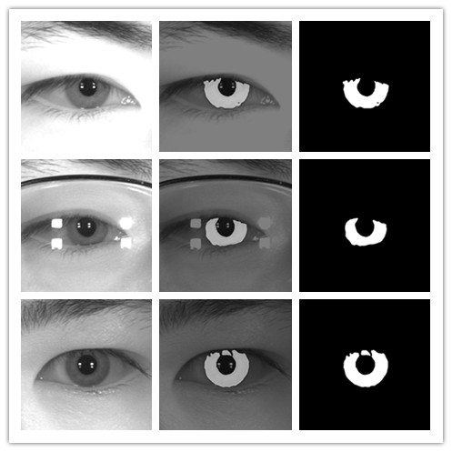
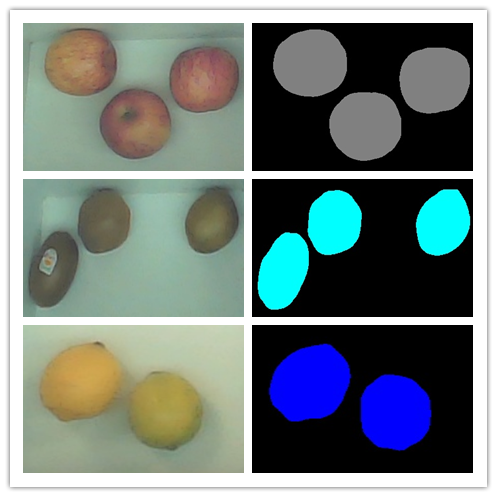
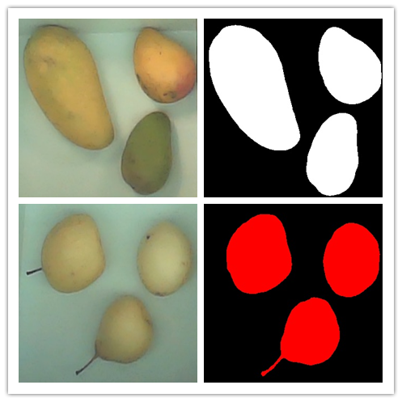

# deeplabv3plus_pytorch

Iris image segmentation and fruit image segmentation based on deeplabv3plus network

### principle
deeplabv3+ contains three parts: backbone, ASPP and Decoder. The backbone obtains a low-level feature and a high-level feature, then inputs the high-level feature into ASPP to obtain multi-scale features, and then upsamples the multi-scale features and fuses the low-level features to obtain fusion features including semantic features and fine-grained features. Finally, Upsample the fused features to get the mask.

### Iris Image Segmentation

#### training process

#### Test Results   

#### Related Datasets
[IrisParseNet](https://github.com/xiamenwcy/IrisParseNet)

### Fruit Image Segmentation

#### Training Process

#### Test Results

#### Related Datasets
[Fruit-Images-Dataset](https://github.com/Horea94/Fruit-Images-Dataset)

## Thanks
[pytorch-deeplab-xception](https://github.com/jfzhang95/pytorch-deeplab-xception)

感谢王博士提供的虹膜图像分割数据[IrisParseNet](https://github.com/xiamenwcy/IrisParseNet)
